Lab 1: Introduction to Statistical Computing Languages
========================================================
*Created by Max Winston*

This class is designed to introduce a variety of concepts, methods, and tools utilized in statistical genetics. The majority of tools used to employ these methods and concepts require basic knowledge of computing languages, specifically Unix and R. In today's lab we will cover the basic syntax of these languages, as well as some basic commands necessary for operating statistical genetic programs. By the end of the lab, you should understand how to perform the following:

- **Basic navigation in R and Unix**
- **Download and install software packages in Unix**
- **Write looped bash commands to run in Unix**
- **Manipulate large text files in Unix**
- **Import large data files into R**
- **Manipulate and visualize files in R**

Section 1: Commonly used commands in Unix
-------------------------------------------------

### *1.1: List of Basic Commands*

Command     |     Description
----------  |   --------------
**pwd**     |   Print working directory (tells you where you are)  
**cd**      |   Change directory  
**mkdir**   |   Make directory  
**ls**      |   List information about files  
**mv**      |   Moves or renames files or directories  
**rm**      |   Deletes files or directories  
**cp**      |   Copy a file to a new location (can copy directories with -r)
**scp**     |   Secure copy a file (for copying from one IP address to another)
**cat**     |   Concatenate and print the content of files  
**sed**     |   Stream editor  
**l**       |   Uses the output of one command as the input for another (known as pipe)  
**>**       |   Writes output into file (must enter file name after, will overwrite)  
**>>**      |   Writes output into file (must enter file name, will append, not overwrite)  
**curl**    |   Transfer a URL (downloads something from the internet)
**tar**     |   Creates tape archives and adds or extracts files
**ssh**     |   Remote log-in command (Secure Shell client)
**emacs**   |   Opens emacs text editor
**man**     |   Access manual for any command (exit = q)
**top**     |   Observe computer's tasks
**sort**    |   Sorts a file (extensive options to direct this command)
**head**    |   Look at first ten lines of file (useful for large files)
**tail**    |   Look at last ten lines of file (useful for large files)  
**./**      |   Existing directory (not a command)  
**../**     |   Directory containing existing directory (not a command)  
**qsub**    |   Submits a job to the server (only for networked computers)
**qstat**   |   Status of a job you've submitted to the server
**grep**    |   Prints lines matching a pattern (helpful for manipulating large files)
  
### *1.2: Logging in and moving files*  
  
For the remainder of the document, please notice that steps requiring action will generally be in bold. For example, **Open Terminal**.  
  
Each of you should have been assigned a username on the server. You will use a Secure SHell client to log in to your home directory on the server. You can do this by:

```{Sys.which("Bash")}

ssh <username>@genemed2.uchicago.edu

```
  
Using the commands listed above, do the following: 
- 1) **Make your own directory**. 
- 2) **Make a second directory**.
- 3) **Look where your directories live**.
- 4) **Move one of your directories into the other**.
- 5) **Change directory to your new directory**.
- 6) **Look inside your new directory**.
- 7) **Move to the original directory**.
- 8) **Read more about rm**
- 9) **Delete both directories you've made**


```{Sys.which("Bash")}

mkdir your_directory/           ##Step 1
mkdir dir_2/                    ##Step 2
pwd                             ##Step 3
mv your_directory/ dir2/        ##Step 4
cd dir2/                        ##Step 5
ls                              ##Step 6
cd ..                           ##Step 7
man rm                          ##Step 8
rm -r dir2/                     ##Step 9

```

### *1.3: Tab-Completion*

Tab completion is helpful for both speed and accuracy. The following exercise will demonstrate this:

- 1) **Make a directory with a really long name**.
- 2) **Start typing the name of the directory**.
- 3) **Hit tab**. The directory should complete itself. 
- 4) **Move back into the previous directory**.
- 5) **Start typing the name of the directory, intentionally introducing an error**.
- 6) **Hit tab**. Notice nothing happens, this indicates you've made an error.

```{Sys.which("Bash")}

mkdir only_an_idiot_would_ever_create_a_directory_like_this/  ##Step 1
cd only_a                                                     ##Step 2
[tab, then enter]                                             ##Step 3
cd ..                                                         ##Step 4
cd olny_a                                                     ##Step 5
[tab]                                                         ##Step 6

```

### *1.4: Using the manual command to explore other commands*

The Unix language has an extensive number of commands, and most of these commands have numerous "options" which can modify these commands. Here we will use the *man* command to understand some of the helpful options in the previously introduced *ls* command.

Generally, the *ls* command will list everything in the directory you are in, but most of the time you will probably want a lot more information then just the name of the files and directories. Furthermore, you may want *ls* to order the contents in a particular way, especially if you have many files in a directory. This can be done by using the options, which are letters added after a dash of a command.

- 1) **Use the manual command to explore the options for listing**.

```{Sys.which("Bash")}

man ls    ##Step 1

```

*Problem 1*  
What command would give you a detailed but human-readable list of the files in a directory in reverse-order of when they have last been modified?

### *1.5: Downloading and unpacking files and programs*

Frequently, you may need files or programs that are not already installed on your computer or server. Often these files are compressed, and often these files are in 'tarballs', which have the extension *.tgz*. IMPUTE2 is a program we'll use later in the semester, so let's download and unpack it:

- 1) **Download the IMPUTE2 tarball from the internet**. Here we download the tarball and write it into the *impute2.tgz* file
- 2) **Unpack the tarball**.

```{Sys.which("Bash")}

curl https://mathgen.stats.ox.ac.uk/impute/impute_v2.3.1_x86_64_static.tgz > impute2.tgz              ##Step 1
tar -zxvf impute2.tgz                                                                                 ##Step 2

```

Once a program is unpacked, generally there is a README file that you can open with a text editor command (i.e. **emacs**), however, every program is different, and reading the manual is the only sure way to install the program correctly.

### *1.6: Manipulating text files*

Often you may have a large text file that you want to manipulate in some way. Using a variety of commands in combination is usually the most effective way to do this, and the "pipe" command allows for a more condense syntax where you use the output of one command as the input for the next. 

As a quick example, we will use a file from the IMPUTE2 directory we just downloaded and unpacked. Specifically, the mapping file provides a fine-scale recombination map with three columns: (1) *physical position (in base pairs)*, (2) *recombination rate between current position and next position in map (in cM/Mb)*, (3) *and genetic map position (in cM)*. Since you may be interested in the physical positions with the greatest recombination rates, we can easily get a list of the top ten using the following:

- 1) **Move into the Example directory**
- 2) **Manipulate the mapping file to create top ten list**. We will name this "*top_ten.map*".  

```{Sys.which("Bash")}

cd impute_v2.3.1_x86_64_static/Example/                     ##Step 1
cat example.chr22.map | sort -k2nr | head > top_ten.map     ##Step 2

```

*Problem 2*  
Step 2 is composed of multiple commands. Use the descriptions of the commands (*Section 1.1*) and the *man* command to describe Step 2 command-by-command.

*Problem 3*  
How would you modify this command if you only wanted the top three? 


### *1.7: Writing bash scripts*

Having the capability to write bash scripts which can be run in the Unix environment is critical, especially for running replicates or collating results from a command-line program. We will write a bash script using the *emacs* text editor, and then run it. Alternatively, feel free to use your own text editor (vim, textwrangler, etc.) to write the script below. Please start with the following: 

- 1) **Create a new script file**. We will name ours *test.sh*.  
- 2) **Add the bash tag at the top of the file**.
- 3) **Write a for-loop to create ten copies of the mapping file with an additional line in each**.
- 4) **Save and exit**.
- 5) **Run script**.

```{Sys.which("Bash")}

emacs test.sh                                                     ##Step 1  

[now in emacs, type]  

#!/bin/bash                                                       ##Step 2

for i in {1..10}; do                                              ##Step 3
    echo "golden nugget" {$i} > top_ten_{$i}.map  ##Step 3
    cat top_ten.map >> top_ten_{$i}.map                           ##Step 3
done                                                              ##Step 3

[exit emacs using ctrl+x+c]                                       ##Step 4

bash test.sh                                                      ##Step 5

```

*Problem 4*  
Find the golden nugget! Write a new script named *extract.sh* where the first line of each of the top ten replicates is written into a single file named *extract.txt*. Note: you may want to refer to Section 1.1 to find a command that can select single lines. 


Section 2: Basic commands in R
-------------------------------------------------

R is used widely for scientific computing, however, the syntax is notably different than Unix. Specifically, two of the most visible differences are that variables are usually assigned with the equals operator, and functions are applied using parentheses. While it can be accessed within the Unix environment, it is often preferable to operate R within the graphical user interface (GUI) known as RStudio. Unlike many poorly made GUIs that offer little advantage to a Unix environment, RStudio offers many organizational and functional benefits. **Open RStudio**.

### *2.1: Reading in data files*

Although data can be simulated, generated, and analyzed all within R, often we may want to visualize or analyze data from some other source. We can observe the differences in syntax by how we import new data. **Use the following commands to set the directory and import the downloaded text file as the data object new_data**:


```r
setwd("~/Desktop/")           
new_data = read.table("file.txt",header=TRUE)
```

### *2.2: Exploring objects, functions and packages*

Once you've imported data as the object *new_data*, you may want to know more about it. **Use the functions *dim* and *class* to explore the object**. Don't forget that you can tab-complete just like you can in the Unix environment.


```r
dim(new_data)
```

```
## [1] 16  2
```

```r
class(new_data)
```

```
## [1] "data.frame"
```

Here we can see that the dimensions of *new_data* are 16 rows and 2 columns, and that it is in *data frame* format. This is important to know since different functions apply differently to different classes, which may cause errors. While *dim* and *class* can be used to explore objects, you may want to explore these functions themselves. This is done by this simple syntax:


```r
?dim
??class
```

*Problem 5*  
What is the difference between using one or two question marks?

Let's stick with the output from a simple query (one question mark). Notice that both *dim* and *class* are relatively simple functions with few arguments. You probably won't have to read the documentation much for either function, but as you develop your skills using statistical genetics you will spend a lot of time reading documentation for more complicated functions with several arguments (i.e. input) and many values (i.e. output).

### *2.3: List of basic classes and functions*

Every R object has a class, and many of the classes overlap (i.e. one object can have more than one class). Below are some of the most useful and common classes.

Class               |           Description
--------------      | -------------------------
**numeric**         |     Object is numeric (integer or double) 
**integer**         |     Object is integer (not double)
**double**          |     Object is double (not integer)
**character**       |     Object is not numeric, composed of characters
**vector**          |     One-dimensional, can contain numeric or characters
**matrix**          |     Two-dimensional, can contain numeric or characters
**array**           |     Multi-dimensional, can contain numeric or characters
**data frame**      |     A list of vectors of equal length, each vector contains same class
**list**            |     A list of various generic vectors
  
Functions are how you execute your commands and write your scripts. It is critical to ensure the arguments are of the correct class (read documentation), as most user-errors originate from providing data in the inappropriate class or dimension. 
  
  
Function                |           Description
--------------          | -------------------------
**c(1,2,3)**            |     Concatenate *numbers* into a vector
**c(1:10)**             |     Concatenate from *number* 1 to *number* 10 in a vector
**c("a","b","c")**      |     Concatenate *characters* into a vector
**cbind(x,y,z)**        |     Binds *vectors* x,y,z into matrix by columns
**rbind(x,y,z)**        |     Binds *vectors* x,y,z into matrix by rows
**matrix(x,nrow,ncol)** |     Creates matrix from *vector* x with *nrow* rows and *ncol* columns
**array(x,dim=y)**      |     Creates array from *vector* x with dimensions of *vector* y
**rep(x,y)**            |     Creates vector repeats *vector* x *integer* y times
**length(x)**           |     Returns length of *object* x
**sample(x,size=n)**    |     Samples number of items (*n*) from elements of *object* x 
**subset(x,subset)**    |     Subsets *object* x by conditions of *subset*   
**mean(x)**             |     Returns arithmetic mean of *numeric object* x
**sd(x)**               |     Returns standard deviation of *numeric object* x
**max(x)**              |     Returns maximum value of *numeric object* x
**min(x)**              |     Returns minimum value of *numeric object* x
**t(x)**                |     Transposes *matrix* x
**plot(x,y)**           |     Plots elements of *vector* x against elements of *vector* y
**boxplot*(x ~ y)**     |     Generates boxplots for values of *numeric vector* x by grouping *vector* y
**lm(x ~ y)**           |     Generates a linear model for response *vector* x by predictor *vector* y 
**density(x)**          |     Estimates density distributions of univariate observations     
**table(x)**              |     Returns summary of frequencies of all values in R object


### *2.4: Simple plotting*
Sometimes the first thing you want to do is generate a really quick plot of your data before anything else. This is one of the advantages of R, in that visualizing data is very intuitive and easy because it is so object-oriented. For example, if you want to plot the first column versus the second column of data from your object, **type the following command**:


```r
plot(new_data$Bob,new_data$Steve)
```

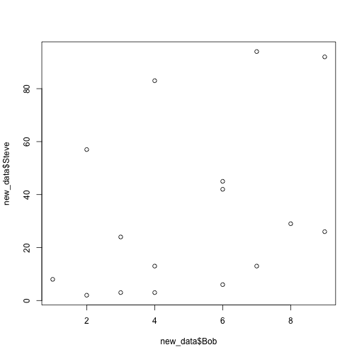 

While we do get to see the data quickly, it's kind of messy. To give the same plot a title and label the axes, you can do this easily by adding the following arguments to the command:  


```r
plot(new_data$Bob,new_data$Steve,main="Cheeseburgers Eaten",xlab="Bob",ylab="Steve")
```

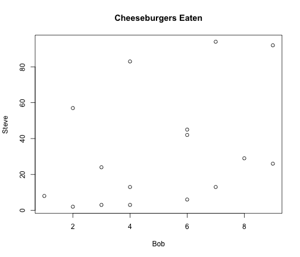 

*Problem 6*  
At first glance the current plot may be a bit misleading because of the differences in scale between the axes. Use the query function learned in Section 2.2 to fix the scale on the axes so that both axis ranges from 0 to 100. Note that the necessary arguments may take vectors.  

### *2.5: Subsetting and targeting elements of R objects using indices*

Although the function *subset* is useful to subset R objects by particular values, objects of classes *vector*,*matrix*,*array*, and *data frame* are designed for quick manipulation using indices. To illustrate this clearly, **type the following commands to create a 3x4 matrix and look at it**:


```r
mat = matrix(1:12,nrow = 3,ncol = 4,byrow=TRUE)
mat
```

```
##      [,1] [,2] [,3] [,4]
## [1,]    1    2    3    4
## [2,]    5    6    7    8
## [3,]    9   10   11   12
```

Notice that above each column R displays the index for that column, and likewise for each row. **Follow the steps below to create a different matrix based on the matrix "mat"**:

- 1) **Make column 1 a vector named "A"**
- 2) **Make column 3 a vector named "C"**
- 3) **Add columns 2 and 4 together to make a vector "BD"**
- 4) **Make a matrix named "new_mat" by binding vectors "A","B","BD" by column**
- 5) **Look at matrix "new_mat"**
- 6) **Multiply the entire matrix "new_mat" by the element in the second row and second column, name "final_mat"**
- 7) **Look at matrix "final_mat"**


```r
A = mat[,1]                       # Step 1
C = mat[,3]                       # Step 2
BD = mat[,2] + mat[,4]            # Step 3
new_mat = cbind(A,C,BD)           # Step 4
new_mat                           # Step 5
```

```
##      A  C BD
## [1,] 1  3  6
## [2,] 5  7 14
## [3,] 9 11 22
```

```r
final_mat = new_mat[2,2]*new_mat  # Step 6
final_mat                         # Step 7
```

```
##       A  C  BD
## [1,]  7 21  42
## [2,] 35 49  98
## [3,] 63 77 154
```

One important note for plotting is that the syntax is different between data frames and matrices. Where data frames use the **$** to extract vectors to plot against each other, matrices use the indices used above to create vectors. For example, to plot the first and second columns of our new matrix "final_mat" against each other, **type the following command**:


```r
plot(final_mat[,1],final_mat[,2])
```

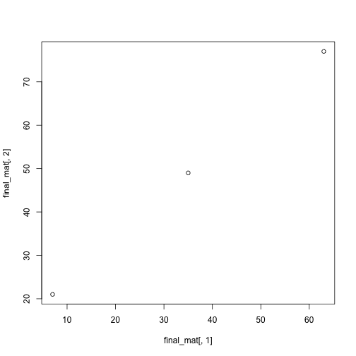 

*Problem 7*
You want a quick estimate on how often you will win the dice game craps on the first roll. You do this by constructing 500 random rolls (2 dice/roll) and looking at the results. Use the *sample* function to sample the numbers 1 to 6 with replacement 1000 times, naming this vector "dice". Take this vector and make it into a matrix named "pairs" with 2 columns and 500 rows, simulating the 500 rolls. Make a new vector summing the first and second rows named "rolls". If 7 and 11 are the two rolls for victory on the first roll, estimate the probability of winning from your 500-roll sample. Hint: The function *table* might be useful in this problem.  

### *2.6: For-loops*
Often in statistical genetics you may need to repeat something several times. For example, collating results over several replicates may require a for-loop that stores the results in an array. **Follow the steps below to generate two arrays of normally-distributed values with different means**:

- 1) **Create an empty array of dimensions (50,100) named "mu_zero"**. We will fill this with 100 vectors, each with 50 randomly-generated numbers. 
- 2) **Create an empty array of the same dimensions (50,100) named "mu_one"**. Same as above, except with a different mean. 
- 3) **Fill "mu_zero" with 100 vectors of normally-distributed values with a mu of zero**
- 4) **Fill "mu_one" with 100 vectors of normally-distributed values with a mu of one**
- 5) **Create an empty array of dimensions (2,100) named "all_means"**
- 6) **Fill "all_means" with the means of each replicate for "mu_zero" and "mu_one"**
- 7) **Look at the first 5 replicates (columns) of the object "all_means"**


```r
mu_zero = array(NA,dim=c(50,100))      # Step 1
mu_one = array(NA,dim=c(50,100))       # Step 2

for (i in 1:100){
  mu_zero[,i] = rnorm(50)
  mu_one[,i] = rnorm(50, mean = 1)     # Steps 3 & 4
}

all_means = array(NA,dim=c(2,100))        # Step 5

for (i in 1:100){
  all_means[1,i] = mean(mu_zero[,i])    # Step 6
  all_means[2,i] = mean(mu_one[,i])
}

all_means[,1:5]                           # Step 7
```

```
##            [,1]       [,2]       [,3]        [,4]       [,5]
## [1,] 0.01861843 0.03084864 -0.0624268 -0.03929249 -0.2816394
## [2,] 1.22830996 0.97757073  1.0180590  0.92610508  1.0871184
```

*Problem 8*  
In the for-loop that accomplishes Steps 3 & 4, why don't we have to specify the mean when we are filling the object "mean_zero"? What standard deviation did we set for these normally-distributed values?

*Problem 9*  
How would you write a command to take the standard deviation of all the replicate means from the "all_means" array?


### *2.7: Installing and loading packages*
Many of the functions you may need in R may not be pre-installed. Luckily, it is very easy to install and load them, especially in RStudio. One package that is suggested for more aesthetic plotting is *"ggplot2"*. It is easy install and load this package, **first install the package by navigating to the packages tab in the bottom right window of RStudio and click the "Install Packages" button. Then, follow the code below to load the package**:


```r
library(ggplot2)
```

You can do this with any package and can also look through all of your installed packages in RStudio to see what is loaded and not loaded already. Occasionally, you may need to install "dependencies", which are required packages to run a specific package. Checking the box next to a package in RStudio is equivalent to using the *library* command.

### *2.8: Introduction to ggplot2*
Although the standard plotting introduced in **Section 2.4** will accomplish all of your plotting needs, many people prefer the aesthetics and functionality of plotting in **ggplot2**. We will do a *very* basic introduction here, just to demonstrate the syntax. 

First, let's create a dataset that we can plot by using the items *"mean_zero"* and *"mean_one"*. **Follow the commands below to create a dataset with x,y coordinates and a grouping variable named "pts"**: 

- 1) **Create matrix "pts_zero" of dimensions (2500,2) filled with data from "mu_zero"**
- 2) **Create matrix "pts_one" of dimensions (2500,2) filled with data from "mu_one"**
- 3) **Add an additional column to "pts_zero" matrix for identification**
- 4) **Add an additional column to "pts_one" matrix for identification**
- 5) **Combine "pts_zero" and "pts_one" matrices into "pts" matrix**


```r
pts_zero = matrix(mu_zero,nrow=2500,ncol=2)   # Step 1
pts_one = matrix(mu_one,nrow=2500,ncol=2)     # Step 2
pts_zero = cbind(pts_zero,rep(0,2500))          # Step 3
pts_one = cbind(pts_one,rep(1,2500))            # Step 4
pts = rbind(pts_zero,pts_one)                   # Step 5
```

Now that we have our dataset "pts", we can use this for our basic introduction to ggplot2. First, let's try to just plot the first two columns (x and y coordinates) using *qplot*, a function made for very basic plotting in ggplot2. **Follow the following steps to generate plots**:


```r
all_pts_plot = qplot(pts[,1],pts[,2])
all_pts_plot
```

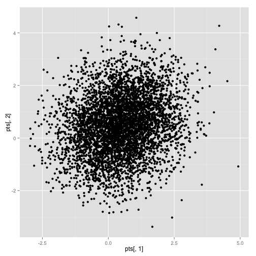 

```r
col_pts_plot = qplot(pts[,1],pts[,2],col=factor(pts[,3]))
col_pts_plot
```

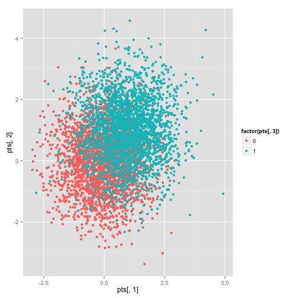 

```r
col_pts_plot_2 = qplot(pts[,1],pts[,2],col=factor(pts[,3]),alpha=0.01)
col_pts_plot_2
```

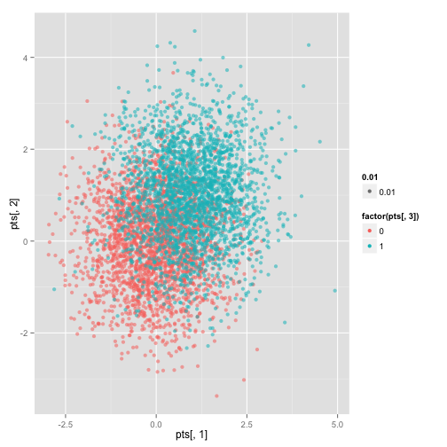 

Notice a couple things here. First, to color the points by the third column (identification of *mean_one* or *mean_zero*), that is simply added to the function via the *col* argument. Second, when there are many dots, sometimes it is helpful to make them semi-transparent so that density is easier to see. This is done via the *alpha* argument, and ranges from 0 (transparent) to 1 (opaque). Finally, notice the coloring is on a spectrum since that is default for numeric. Since it is kind of confusing, we may want to provide characters as factors instead. To do this, **follow these commands**:


```r
m_0 = rep("mu_zero",2500)
m_1 = rep("mu_one",2500)
Mean = c(m_0,m_1)
qplot(pts[,1],pts[,2],col=Mean,alpha=0.01)
```

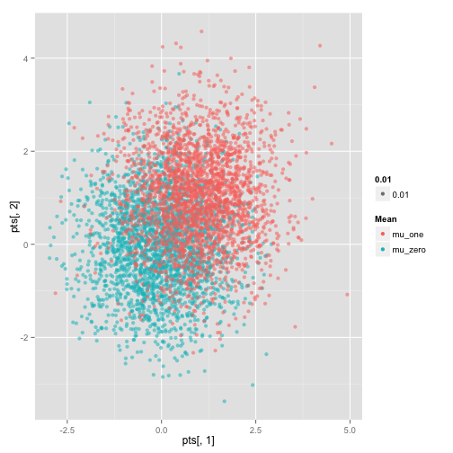 

Although the syntax is more similar to what we first learned, the qplot function does not fully exploit all the advantages of ggplot2. A more functional plotting function is *geom_point*. Let's try plotting our data with *geom_point*:


```r
pts_df = as.data.frame(pts)
d_plot = ggplot(pts_df, aes(V1,V2))
d_plot + geom_point()
```

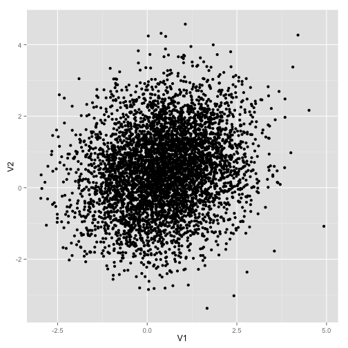 

```r
d_plot = ggplot(pts_df, aes(V1,V2,group=V3,color=V3))
d_plot + geom_point()
```

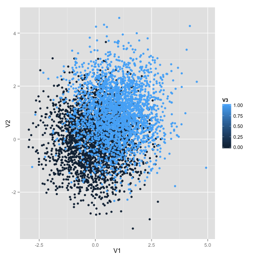 

```r
d_plot = ggplot(pts_df, aes(V1,V2,group=factor(V3),color=factor(V3)))
d_plot + geom_point()
```

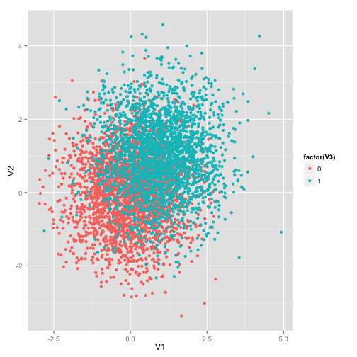 

Here we have essentially done the same thing with the *geom_point* function as we did with the *qplot* function, but in a different, less-intuitive syntax. Let's make one final change to our dataset to demonstrate one of the many functionalities *geom_point* has that *qplot* does not. **Follow these commands to add an additional column to our data frame "pts_df"**:


```r
pts = cbind(pts,rep(1:10,500))
pts_df = as.data.frame(pts)
bubbleplot = ggplot(pts_df, aes(V1,V2,group=factor(V3),color=factor(V3)))
bubbleplot + geom_point(aes(size = V4,alpha=0.00001))
```

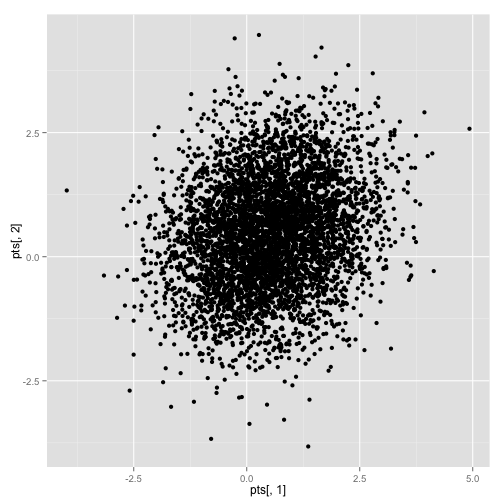 
